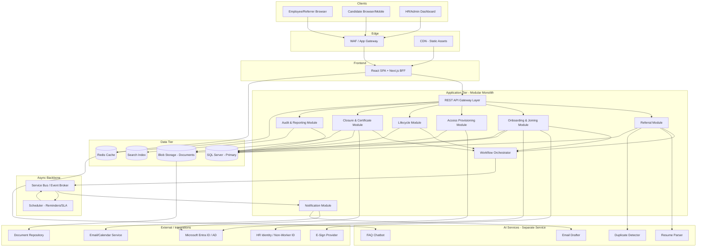

# Intern Flow — Architectural Analysis

**Source:** Business Requirements Document (BRD) v1.0 — Internship Program Automation (Unpaid Internships)
**Prepared by:** Senior Software Architect review
**Date:** 2026-04-28

---

## 1. Functional Summary

### 1.1 Core Features
1. **Referral Intake Portal** — standardized internal submission point with mandatory-field validation and timestamped logging.
2. **AI-Assisted Resume Parsing & Prefill** — extracts name/email/phone/education/skills with confidence scoring and human override.
3. **Eligibility & Readiness Checks** — unpaid consent, in-person readiness, location alignment.
4. **Duplicate & Conflict Detection** — AI-driven deduplication against existing candidates/referrals.
5. **Digital Joining Form** — save-draft, attachments, validations, HR-side lock.
6. **Non-Worker ID Provisioning Workflow** — auto-triggered task with 1-business-day SLA.
7. **NDA Issuance via E-Sign** — start of internship blocked until NDA executed; digital archival.
8. **Offer / Confirmation Letter Generation** — templated, branded, on letterhead.
9. **Active Directory Account Provisioning** — secure credential delivery via OTP / magic link.
10. **Lifecycle Tracking** — start, delay, extension, closure events with reminders and escalations.
11. **Closure & Deactivation** — auto-trigger AD deactivation ≤24 hours post end-date.
12. **Certificate Request & Issuance** — post-completion request form, generated on letterhead, archived.
13. **Notifications Engine** — event-driven email + reminders with 3-strike escalation.
14. **Dashboards & Reporting** — stage counts, SLA breaches, average cycle time, completion ratio.
15. **Knowledge-Base Chatbot** — FAQ assistant for stakeholders.
16. **Immutable Audit Trail** — all events logged for compliance.

### 1.2 Primary User Roles / Actors
| Role | Description |
|---|---|
| **Referrer (Employee)** | Submits referral; primary candidate contact. |
| **Candidate / Intern** | External user; completes joining form, signs NDA, executes internship. |
| **Mentor (Employee)** | Defines project scope; guides intern; confirms start/end. |
| **HR** | Issues Non-Worker ID, NDA, letters; owns closure. |
| **Program Owner** | Governance, SLAs, escalations, executive reporting. |
| **Admin & Security** | Site access, badge issuance, facilities. |
| **IT / AD Team** | AD account provisioning and deactivation. |
| **Legal / Compliance** | Approves NDA templates, defines retention policies. |
| **System / AI Agents** | Automated actors performing parsing, validation, drafting. |

### 1.3 Key User Flows (Happy Path)

**Flow A — Referral to Ready-to-Start:**
1. Referrer logs into portal (SSO) → uploads candidate resume.
2. AI parses resume → prefills referral form → Referrer reviews/overrides.
3. Referrer confirms eligibility flags (unpaid, in-person, location) → submits.
4. AI runs duplicate-detection → either flags conflict or routes to HR queue.
5. HR reviews → triggers Non-Worker ID creation (SLA 1 day) → sends Joining Form link to Candidate.
6. Candidate completes Joining Form (with attachments) → submits.
7. HR locks the form → e-sign workflow triggered → Candidate signs NDA.
8. IT provisions AD credentials → secure delivery via OTP/magic link.
9. Admin/Security alerted to issue badge & site access.
10. Mentor receives intern dossier; mutual connect prompt sent to both parties.
11. Confirmation letter issued; status = **Ready-to-Start**.

**Flow B — Internship Execution & Closure:**
1. Start-date reached → start confirmation captured by Mentor.
2. Mid-tenure: lifecycle events tracked (delay, extension) with reminders.
3. End-date approaches → Mentor & HR receive closure reminders.
4. AD deactivation triggered ≤24h post end-date.
5. Candidate submits Certificate Request → certificate auto-generated on letterhead.
6. Document archived to repository; audit trail finalized.

---

## 2. System Architecture

### 2.1 Recommended Pattern: **Modular Monolith with Event-Driven Workflow Orchestration**

Not a microservices architecture — and that is a deliberate choice. See justification below.

### 2.2 High-Level Component Diagram



### 2.3 Justification for the Pattern

| Factor | Why Modular Monolith Wins for Intern Flow |
|---|---|
| **Scale (NFR-7)** | Only 500 concurrent users — full microservices is over-engineered. |
| **Timeline** | BRD calls for 9–13 weeks total. Microservices distributed-systems overhead would jeopardize this. |
| **Team size** | An internal HR-tooling project rarely warrants 5+ independent service teams. |
| **Transactional consistency** | Referral → Joining → NDA → Provisioning is one logical business transaction; cross-service sagas add risk. |
| **Operational simplicity** | One deploy, one DB, one log aggregator. Critical given enterprise IT support model. |
| **Future-proofing** | Strict module boundaries (separate schemas, internal interfaces, async events) leave a clean path to extract services later if scale demands it. |
| **AI carve-out** | The single exception: AI services have different scaling, dependency, and update cadences (Python ML stack vs. business logic) — extract them as a sibling service from day one. |
| **Event-driven core** | Workflow inherently event-driven (FR-7 "auto-trigger", FR-8 "blocked until signed", reminder/escalation logic) — async messaging is mandatory regardless of monolith vs. microservice topology. |

**Summary:** Modular monolith for the business logic + a separate AI service + an async messaging backbone for workflow events. The simplest architecture that actually meets every NFR.

---

## 3. Module Breakdown

| # | Module | Single-Sentence Responsibility | Depends On |
|---|---|---|---|
| 1 | **Identity & Access** | Authenticates users via SSO and enforces role-based authorization for every request. | Microsoft Entra ID |
| 2 | **Referral Module** | Owns the Referral Form, AI-prefill orchestration, eligibility checks, and submission. | AI Service, Notification, Audit |
| 3 | **Onboarding & Joining Module** | Owns Joining Form lifecycle (draft → submit → HR-lock) and Non-Worker ID requests. | HRIS, E-Sign, Notification, Audit |
| 4 | **NDA & Document Module** | Generates templated NDAs/letters/certificates and orchestrates e-signing. | E-Sign provider, Blob Storage |
| 5 | **Access Provisioning Module** | Provisions and deactivates AD accounts; delivers credentials securely. | Active Directory, Notification |
| 6 | **Lifecycle Module** | Tracks start/delay/extension/closure events and SLA timers. | Workflow Orchestrator, Scheduler |
| 7 | **Closure & Certificate Module** | Orchestrates end-of-internship deactivation and certificate issuance. | Access Provisioning, NDA & Document |
| 8 | **Notification Module** | Renders templates, drafts content (AI-assisted), dispatches email; tracks delivery. | Email service, AI Service |
| 9 | **Workflow Orchestrator** | Encodes the 17-step state machine; produces and consumes domain events. | Service Bus, all business modules |
| 10 | **Scheduler / SLA Engine** | Fires time-based reminders, escalations, and SLA-breach events. | Service Bus, Audit |
| 11 | **Audit & Reporting Module** | Persists immutable event log; powers dashboards (stage counts, SLA breach, cycle time). | DB, Search Index |
| 12 | **AI Service (separate process)** | Hosts resume parser, duplicate detector, email drafter, and FAQ chatbot. | Storage, model registry |
| 13 | **Document Storage Module** | Manages secure object storage with retention and access policies. | Blob Storage, DocRepo |
| 14 | **Admin / Configuration Module** | Manages email templates, SLA thresholds, role mappings, and escalation matrix. | DB |

---

## 4. Technology Stack

| Layer | Recommended Tech | Alternatives | Why Chosen |
|---|---|---|---|
| **Backend** | **.NET 8 (ASP.NET Core, C#)** | Java + Spring Boot; Node.js + NestJS | First-class integration with Active Directory / Entra ID and Microsoft enterprise stack. Strong typing, mature DI, robust async, and proven at this scale. Most enterprises with internal AD already have .NET ops capacity. |
| **Frontend** | **React 18 + Next.js 14 (TypeScript)** | Angular; Vue/Nuxt; Blazor | Largest talent pool, mature ecosystem, SSR/BFF for secure token handling, easy WCAG 2.1 AA compliance with Radix/MUI, mobile-friendly. Works seamlessly behind enterprise SSO. |
| **Database** | **Azure SQL / SQL Server 2022** | PostgreSQL; Aurora MySQL | Strong transactional integrity for the referral→onboarding→NDA chain; row-level security for RBAC; temporal tables for built-in audit; native AD authentication; aligns with Microsoft enterprise tooling. |
| **Messaging** | **Azure Service Bus (topics + queues)** | RabbitMQ; Kafka; AWS SQS/SNS | Workload is workflow events, not high-throughput streaming — Service Bus offers managed FIFO sessions, dead-letter queues, scheduled messages, and duplicate detection out of the box. Kafka is overkill for ~500 users. |
| **Auth** | **Microsoft Entra ID (Azure AD) + OAuth 2.0 / OIDC, JWT bearer tokens; B2C tenant for external candidates** | Okta; Auth0; Keycloak | Internal users already exist in Entra ID — zero onboarding friction. B2C handles the external-candidate edge case (candidates aren't employees yet). Native AD account provisioning closes the loop with FR-13. |
| **Infra / Cloud** | **Microsoft Azure** (App Service or AKS, Service Bus, Azure SQL, Blob, Key Vault, App Gateway + WAF, Application Insights) | AWS; GCP | Tight coupling with Entra ID and on-prem AD via Azure AD Connect. Government/Enterprise compliance certifications (ISO 27001, SOC 2). Best TCO when the existing identity stack is Microsoft. |
| **CI/CD** | **Azure DevOps Pipelines** (or GitHub Actions if org standard) | Jenkins; GitLab CI; CircleCI | Native integration with Azure resources, built-in environments/approvals/secrets, strong RBAC tied to Entra ID, free tier sufficient for a single internal app. |
| **Observability** | **Azure Application Insights + Azure Monitor + Log Analytics** (correlation IDs, distributed tracing via OpenTelemetry) | Datadog; Grafana + Prometheus + Loki; New Relic | Zero-friction integration with .NET and Azure services. Pre-built dashboards for SLA tracking. Log Analytics queries (KQL) are excellent for compliance audit reporting. |
| **AI / ML** | **Azure OpenAI Service (GPT-4 class models) for parsing & drafting; Azure AI Document Intelligence for resume OCR; pgvector or Azure AI Search for embeddings** | AWS Bedrock; Anthropic API direct; OpenAI public API; spaCy/self-hosted | Enterprise data-residency and DLP guarantees, integrated Entra auth, and content-filtering. Document Intelligence handles the OCR for scanned resumes that pure LLMs would miss. |
| **E-Sign** | **DocuSign** (or Adobe Acrobat Sign) | HelloSign/Dropbox Sign; PandaDoc | Industry standard; mature REST + webhook API for embedded e-signing; legally defensible audit certificates; pre-built connectors. |
| **Caching** | **Redis (Azure Cache for Redis)** | In-memory; Memcached | Sub-3s form-load NFR; session affinity; distributed lock for SLA-timer races. |
| **Document Storage** | **Azure Blob Storage with immutable (WORM) policies** + lifecycle tiering | S3; on-prem SharePoint/DocRepo | Compliance retention, encryption at rest with customer-managed keys, native integration; cheap cold tier for closed internships. |

---

## 5. API Design

### 5.1 Auth Strategy
- **OAuth 2.0 + OIDC via Microsoft Entra ID** with **JWT bearer access tokens**.
- Internal users (Referrer/Mentor/HR/IT/Admin/Program Owner) authenticate against the corporate Entra ID tenant (SSO).
- External candidates authenticate against an **Entra ID B2C tenant** (or via signed magic-link tokens for first-time joining-form access).
- All API endpoints require valid JWT; **role claims** drive authorization (RBAC enforced via policy middleware).
- Integration secrets (DocuSign, AD service principal, Email/Calendar) stored in **Azure Key Vault**.
- **CSRF + same-site cookies** at the BFF boundary; token-binding via PKCE.

### 5.2 REST Endpoints (selected, not exhaustive)

| Method | Path | Purpose | Roles |
|---|---|---|---|
| `POST` | `/api/v1/referrals` | Create new referral (initial draft) | Referrer |
| `GET` | `/api/v1/referrals/{id}` | Fetch referral details | Referrer, HR, Mentor, Program Owner |
| `PUT` | `/api/v1/referrals/{id}` | Update draft referral | Referrer |
| `POST` | `/api/v1/referrals/{id}/submit` | Submit for HR review | Referrer |
| `POST` | `/api/v1/referrals/{id}/resume:parse` | Trigger AI parse + prefill | Referrer (system-internal call) |
| `POST` | `/api/v1/referrals/{id}/eligibility:validate` | Run eligibility/dedup checks | Referrer |
| `GET` | `/api/v1/referrals?status=&assignee=&page=` | Search/list referrals | HR, Program Owner |
| `POST` | `/api/v1/joining-forms` | Create joining form (candidate) | Candidate |
| `PUT` | `/api/v1/joining-forms/{id}` | Save draft / update | Candidate |
| `POST` | `/api/v1/joining-forms/{id}/submit` | Final submission | Candidate |
| `POST` | `/api/v1/joining-forms/{id}/lock` | HR locks form | HR |
| `POST` | `/api/v1/joining-forms/{id}/attachments` | Upload supporting document | Candidate |
| `POST` | `/api/v1/non-worker-ids` | Create Non-Worker ID request | HR |
| `PATCH` | `/api/v1/non-worker-ids/{id}` | Update status (issued/failed) | HR, HRIS-webhook |
| `POST` | `/api/v1/nda/{candidateId}:issue` | Issue NDA via e-sign | HR |
| `POST` | `/api/v1/webhooks/esign` | DocuSign webhook callback | DocuSign IP allow-list |
| `POST` | `/api/v1/access/provision` | Trigger AD account creation | IT |
| `POST` | `/api/v1/access/deactivate` | Trigger AD deactivation | IT, system |
| `POST` | `/api/v1/access/credentials/deliver` | Send OTP/magic-link | IT |
| `GET` | `/api/v1/internships/{id}/timeline` | Fetch lifecycle events | All assigned roles |
| `POST` | `/api/v1/internships/{id}/extend` | Request extension | Mentor, HR |
| `POST` | `/api/v1/internships/{id}/close` | Mark closure | HR, Mentor |
| `POST` | `/api/v1/certificates` | Submit certificate request | Candidate |
| `POST` | `/api/v1/certificates/{id}/issue` | Generate & archive certificate | HR |
| `GET` | `/api/v1/dashboards/sla` | SLA dashboard data | Program Owner, HR |
| `GET` | `/api/v1/dashboards/stages` | Stage counts | Program Owner |
| `GET` | `/api/v1/audit?entityId=&from=&to=` | Query audit log | Program Owner, Compliance |
| `POST` | `/api/v1/notifications/templates` | Manage email templates | Program Owner |
| `POST` | `/api/v1/chatbot/query` | FAQ chatbot query | All authenticated |

### 5.3 API Conventions
- Versioning via URL prefix (`/api/v1/`).
- Idempotency keys on all `POST`/`PATCH` endpoints that trigger side effects (AD calls, email sends, e-sign issuance).
- Problem+JSON (RFC 7807) for error responses.
- HATEOAS-style links for workflow next-actions in resource responses.
- Webhook endpoints HMAC-signed and IP-restricted.

---

## 6. Data Model

### 6.1 Core Entities

| Entity | Key Attributes |
|---|---|
| **User** | `user_id`, `entra_object_id`, `email`, `display_name`, `roles[]`, `department`, `is_active` |
| **Referral** | `referral_id`, `referrer_user_id`, `mentor_user_id`, `candidate_id`, `status`, `eligibility_flags`, `created_at`, `submitted_at`, `dedup_score` |
| **Candidate** | `candidate_id`, `name`, `email`, `phone`, `education[]`, `skills[]`, `government_ids[]`, `address`, `emergency_contact` |
| **JoiningForm** | `form_id`, `referral_id`, `candidate_id`, `status` (draft/submitted/locked), `attachments[]`, `signed_declaration_url`, `submitted_at`, `locked_by`, `locked_at` |
| **NonWorkerId** | `nwid`, `candidate_id`, `requested_at`, `issued_at`, `sla_due_at`, `status`, `assigned_to` |
| **NDA** | `nda_id`, `candidate_id`, `template_version`, `esign_envelope_id`, `status`, `signed_at`, `archived_url` |
| **Internship** | `internship_id`, `candidate_id`, `mentor_user_id`, `start_date`, `end_date`, `original_end_date`, `project_overview`, `location`, `status` |
| **AccessAccount** | `account_id`, `internship_id`, `ad_username`, `provisioned_at`, `deactivated_at`, `credential_delivery_method` |
| **Certificate** | `certificate_id`, `internship_id`, `requested_at`, `issued_at`, `archived_url`, `template_version` |
| **NotificationEvent** | `event_id`, `type`, `recipient`, `template_id`, `status` (queued/sent/bounced), `attempted_at`, `correlation_id` |
| **WorkflowInstance** | `instance_id`, `referral_id`, `current_step`, `state_json`, `sla_breaches[]` |
| **AuditEvent** *(append-only)* | `event_id`, `actor_user_id`, `entity_type`, `entity_id`, `action`, `before_json`, `after_json`, `ip`, `timestamp` |
| **EmailTemplate** | `template_id`, `name`, `subject`, `body_md`, `version`, `active` |

### 6.2 Relationships
- `User (1) ──< (N) Referral` — referrer / mentor
- `Referral (1) ── (1) Candidate`
- `Referral (1) ── (0..1) JoiningForm`
- `JoiningForm (1) ── (0..1) NonWorkerId`
- `Candidate (1) ── (0..1) NDA`
- `Referral (1) ── (0..1) Internship`
- `Internship (1) ── (0..1) AccessAccount`
- `Internship (1) ── (0..1) Certificate`
- `Internship (1) ──< (N) NotificationEvent`
- `Referral (1) ──< (N) AuditEvent` (entity-polymorphic)
- `Candidate (N) >── (M) Skill` (many-to-many via `CandidateSkill`)

### 6.3 Suggested SQL DDL (abridged, SQL Server flavor)

```sql
CREATE TABLE [User] (
    UserId           UNIQUEIDENTIFIER PRIMARY KEY DEFAULT NEWID(),
    EntraObjectId    NVARCHAR(64) UNIQUE NOT NULL,
    Email            NVARCHAR(256) NOT NULL,
    DisplayName      NVARCHAR(256) NOT NULL,
    Department       NVARCHAR(128),
    IsActive         BIT NOT NULL DEFAULT 1,
    CreatedAt        DATETIME2 NOT NULL DEFAULT SYSUTCDATETIME()
);

CREATE TABLE Candidate (
    CandidateId          UNIQUEIDENTIFIER PRIMARY KEY DEFAULT NEWID(),
    FullName             NVARCHAR(256) NOT NULL,
    Email                NVARCHAR(256) NOT NULL,
    Phone                NVARCHAR(32),
    AddressJson          NVARCHAR(MAX),
    EmergencyContactJson NVARCHAR(MAX),
    GovIdsEncrypted      VARBINARY(MAX),
    CreatedAt            DATETIME2 NOT NULL DEFAULT SYSUTCDATETIME(),
    INDEX IX_Candidate_Email NONCLUSTERED (Email)
);

CREATE TABLE Referral (
    ReferralId        UNIQUEIDENTIFIER PRIMARY KEY DEFAULT NEWID(),
    ReferrerUserId    UNIQUEIDENTIFIER NOT NULL REFERENCES [User](UserId),
    MentorUserId      UNIQUEIDENTIFIER NOT NULL REFERENCES [User](UserId),
    CandidateId       UNIQUEIDENTIFIER NOT NULL REFERENCES Candidate(CandidateId),
    Status            NVARCHAR(32) NOT NULL,
    EligibilityFlags  NVARCHAR(512) NOT NULL,
    DedupScore        DECIMAL(5,2),
    ProjectOverview   NVARCHAR(2000),
    PlannedStartDate  DATE,
    PlannedEndDate    DATE,
    Location          NVARCHAR(128),
    CreatedAt         DATETIME2 NOT NULL DEFAULT SYSUTCDATETIME(),
    SubmittedAt       DATETIME2
)
WITH (SYSTEM_VERSIONING = ON);

CREATE TABLE JoiningForm (
    FormId        UNIQUEIDENTIFIER PRIMARY KEY DEFAULT NEWID(),
    ReferralId    UNIQUEIDENTIFIER NOT NULL UNIQUE REFERENCES Referral(ReferralId),
    Status        NVARCHAR(32) NOT NULL,
    PayloadJson   NVARCHAR(MAX) NOT NULL,
    SubmittedAt   DATETIME2,
    LockedBy      UNIQUEIDENTIFIER REFERENCES [User](UserId),
    LockedAt      DATETIME2
);

CREATE TABLE NonWorkerId (
    NonWorkerIdId  UNIQUEIDENTIFIER PRIMARY KEY DEFAULT NEWID(),
    CandidateId    UNIQUEIDENTIFIER NOT NULL REFERENCES Candidate(CandidateId),
    NwidValue      NVARCHAR(64) UNIQUE,
    RequestedAt    DATETIME2 NOT NULL,
    SlaDueAt       DATETIME2 NOT NULL,
    IssuedAt       DATETIME2,
    Status         NVARCHAR(32) NOT NULL
);

CREATE TABLE NDA (
    NdaId             UNIQUEIDENTIFIER PRIMARY KEY DEFAULT NEWID(),
    CandidateId       UNIQUEIDENTIFIER NOT NULL REFERENCES Candidate(CandidateId),
    TemplateVersion   NVARCHAR(32) NOT NULL,
    EsignEnvelopeId   NVARCHAR(128),
    Status            NVARCHAR(32) NOT NULL,
    SignedAt          DATETIME2,
    ArchivedUrl       NVARCHAR(512)
);

CREATE TABLE Internship (
    InternshipId      UNIQUEIDENTIFIER PRIMARY KEY DEFAULT NEWID(),
    ReferralId        UNIQUEIDENTIFIER NOT NULL UNIQUE REFERENCES Referral(ReferralId),
    StartDate         DATE NOT NULL,
    EndDate           DATE NOT NULL,
    OriginalEndDate   DATE NOT NULL,
    Status            NVARCHAR(32) NOT NULL,
    INDEX IX_Internship_EndDate (EndDate)
);

CREATE TABLE AccessAccount (
    AccountId             UNIQUEIDENTIFIER PRIMARY KEY DEFAULT NEWID(),
    InternshipId          UNIQUEIDENTIFIER NOT NULL UNIQUE REFERENCES Internship(InternshipId),
    AdUsername            NVARCHAR(128),
    ProvisionedAt         DATETIME2,
    DeactivatedAt         DATETIME2,
    CredentialDelivery    NVARCHAR(32)
);

CREATE TABLE NotificationEvent (
    EventId          UNIQUEIDENTIFIER PRIMARY KEY DEFAULT NEWID(),
    CorrelationId    UNIQUEIDENTIFIER NOT NULL,
    Type             NVARCHAR(64) NOT NULL,
    Recipient        NVARCHAR(256) NOT NULL,
    TemplateId       UNIQUEIDENTIFIER NOT NULL,
    Status           NVARCHAR(32) NOT NULL,
    AttemptedAt      DATETIME2,
    BounceReason     NVARCHAR(512)
);

-- Append-only audit (write-only by app role; immutable via DB-level grant)
CREATE TABLE AuditEvent (
    EventId       BIGINT IDENTITY PRIMARY KEY,
    ActorUserId   UNIQUEIDENTIFIER,
    EntityType    NVARCHAR(64) NOT NULL,
    EntityId      UNIQUEIDENTIFIER NOT NULL,
    Action        NVARCHAR(64) NOT NULL,
    BeforeJson    NVARCHAR(MAX),
    AfterJson     NVARCHAR(MAX),
    Ip            NVARCHAR(64),
    OccurredAt    DATETIME2 NOT NULL DEFAULT SYSUTCDATETIME(),
    INDEX IX_Audit_Entity (EntityType, EntityId, OccurredAt DESC)
);
```

**Notes on the schema:**
- `Referral` uses **temporal tables** (`SYSTEM_VERSIONING = ON`) to satisfy NFR-4 (immutable history) at the row level.
- `Candidate.GovIdsEncrypted` uses **Always Encrypted** with a column master key in Key Vault.
- Audit table has **REVOKE UPDATE, DELETE** at the DB role level — append-only enforced.
- Row-Level Security policies restrict HR rows to HR principals, mentor rows to assigned mentors, etc.

---

## 7. Non-Functional Requirements

### 7.1 Scalability (NFR-7: ≥500 concurrent users)
- Stateless API tier behind App Gateway → horizontal autoscale on App Service Plan or AKS HPA (CPU + queue-depth metrics).
- Distributed Redis cache for session/state.
- DB sized for peak; **read replicas** for dashboards (`/api/v1/dashboards/*` reads from replica).
- Async non-blocking workflow steps via Service Bus → naturally absorbs spikes.
- **Capacity headroom target: 3× peak** (1,500 concurrent) for cycle spikes during semester start.

### 7.2 Security (NFR-1)
- **Encryption in transit:** TLS 1.3 only; HSTS + perfect-forward-secrecy ciphers.
- **Encryption at rest:** TDE on Azure SQL; Always Encrypted on PII columns; Blob storage SSE with customer-managed keys.
- **RBAC:** Entra ID role claims → ASP.NET Core authorization policies; row-level security in DB.
- **Least privilege:** managed identities for service-to-service auth; no shared secrets in code.
- **Secrets:** Azure Key Vault, automatic rotation for DB / DocuSign / SMTP credentials.
- **WAF:** OWASP Top 10 ruleset on Application Gateway; rate-limiting on candidate-facing endpoints.
- **Threat modeling:** STRIDE assessment per module pre-go-live.
- **Data retention:** policy-driven (Legal/Compliance owns), enforced via Blob lifecycle rules + scheduled DB purge jobs.
- **Magic-link / OTP** for credential delivery (FR-13): one-time, short TTL, IP-bound.
- **Audit immutability:** DB-level + WORM Blob policies for archived documents.
- **PII scoping:** mentors see dossier only after candidate's NDA is signed; referrers cannot view government IDs.

### 7.3 Performance (NFR-3: <3s form load, <5min triggers)
- CDN for static frontend bundles.
- Server-side rendering / React Server Components for first paint.
- DB indexes per common query path (status, assignee, end-date).
- **p95 < 500ms** for read APIs; **p95 < 1.5s** for AI-bearing writes (parse).
- Workflow events processed within 60s of emission (well under the 5-min trigger NFR).
- AI parsing has its own SLO: **p95 < 8s** (async with optimistic UI).

### 7.4 Availability / Fault Tolerance (NFR-2: ≥99.5%)
- **Active-passive multi-region** deployment (primary East US, DR West Europe, for example) with Azure Front Door.
- Azure SQL with **auto-failover groups** (RPO ≤ 5s, RTO ≤ 60s).
- Service Bus geo-disaster-recovery pairing.
- Blob storage RA-GRS.
- All workflow steps **idempotent** with idempotency keys.
- **Dead-letter queue** monitoring with auto-paging.
- Circuit breakers (Polly) around DocuSign / AAD / HRIS / SMTP integrations.
- Graceful degradation: if AI service is down, manual form entry is still possible (parsing is best-effort).
- **RTO ≤ 1 hour, RPO ≤ 15 minutes.**

### 7.5 Compliance & Audit (NFR-4, NFR-6)
- Immutable audit event log + temporal tables.
- Quarterly access reviews for privileged roles.
- WCAG 2.1 AA conformance verified by axe-core in CI + manual screen-reader testing.
- DPIA / privacy review for candidate PII (esp. government IDs).

---

## 8. Deployment Strategy

### 8.1 Cloud Provider: **Microsoft Azure**
Chosen because Entra ID, on-prem AD, e-sign integrations, and Office 365 (email/calendar) are already-in-use Microsoft assets at most enterprises that run unpaid-internship programs. Azure delivers the lowest integration friction and the best identity story.

### 8.2 Containerisation
- **Docker** images for: `api`, `worker` (background processors), `ai-service`, `frontend-bff`.
- **Azure Kubernetes Service (AKS)** for orchestration *if* the org already runs AKS; otherwise prefer **Azure App Service for Containers** + **Azure Container Apps** for the worker — same containers, dramatically less operational overhead.
- **Recommendation given timeline (9–13 weeks): Azure Container Apps + Azure App Service.** Save AKS migration for v2.

### 8.3 CI/CD Pipeline (Azure DevOps or GitHub Actions)

```
┌────────┐  ┌──────────┐  ┌──────────┐  ┌──────────────┐  ┌─────────────┐  ┌──────────────┐  ┌────────┐
│ Commit ├─▶│   Lint   ├─▶│ Unit + IT├─▶│  Container   ├─▶│  Security   ├─▶│   Deploy     ├─▶│ Smoke  │
│        │  │  + Type  │  │  Tests   │  │  Build/Push  │  │ Scan + SBOM │  │ to Env (gated)│  │ Tests  │
└────────┘  └──────────┘  └──────────┘  └──────────────┘  └─────────────┘  └──────────────┘  └────────┘
```

Stages:
1. **Lint & static analysis** — ESLint, Prettier, dotnet format, SonarCloud.
2. **Unit tests** (xUnit, Vitest) — 80% line-coverage gate.
3. **Integration tests** — Testcontainers for SQL Server + Azure Service Bus emulator.
4. **Container build & push** — multi-arch images to Azure Container Registry; image-tag = git SHA.
5. **Security scan** — Trivy / Defender for Containers + dependency CVE check; SBOM generation.
6. **Deploy to Dev** — auto on `main`.
7. **Deploy to Staging** — auto with smoke tests; blue/green slot swap.
8. **Deploy to Prod** — manual approval (Program Owner + IT lead); blue/green deployment with 10% canary for 30 min, then full cutover.
9. **Post-deploy** — synthetic monitoring alarms + DB migration verification.

### 8.4 Environment Strategy

| Env | Purpose | Data | Access |
|---|---|---|---|
| **Local** | Developer machines | Synthetic data; LocalDB / SQL Server container | Developers |
| **Dev** | Continuous integration target | Synthetic data refreshed nightly | Engineering |
| **Staging / UAT** | Stakeholder UAT, pilot, performance tests | Production-like volume, scrubbed PII | HR pilot users + QA |
| **Pre-Prod** | Smoke + DR drill | Mirror of prod (read-only) | Platform team |
| **Prod** | Live | Real PII; full compliance controls | All users; engineers via JIT/PIM only |

**DB migrations:** EF Core migrations applied via pipeline, **expand-and-contract pattern** for breaking changes, with mandatory rollback script per migration.

**Feature flags:** Azure App Configuration with feature management for risky rollouts (initial AI features, escalation logic).

---

## 9. Risks Beyond the BRD & Mitigations

| Risk | Mitigation |
|---|---|
| **AI hallucination on resume parsing** affects compliance | Confidence threshold gating + mandatory human-review checkbox before submission; log all overrides. |
| **DocuSign / AD outage blocks onboarding** | Circuit breakers + retry-with-backoff; manual-fallback admin screen for HR to record signed-paper NDAs and trigger downstream events. |
| **Email deliverability** (NFR: bounces ≤1%) | Use authenticated tenant SMTP (M365) with DMARC/DKIM/SPF; bounce-webhook capture; dead-letter for retry. |
| **Long-tail PII retention in Blob** post-graduation | Lifecycle policies + scheduled compliance review; legal sign-off on retention years per data class. |
| **Single-tenant scope creep into multi-tenant** | Design schemas with implicit `tenant_id` column placeholder ignored in v1, used in v2 if needed. |
| **AI service vendor lock-in** | Abstract via internal `IAiResumeParser`, `IDuplicateDetector` interfaces — Azure OpenAI today, swappable tomorrow. |

---

## 10. Implementation Roadmap (mapped to BRD's 11–13 week plan)

| Week | Deliverables |
|---|---|
| **1–2 — Design & Sign-off** | Final architecture, ERDs, API contracts, security review, NDA template approval |
| **3–6 — Build & Workflow** | Auth, RBAC, Referral, Joining Form, Notification, Workflow Orchestrator, Audit |
| **5–7 — Integrations (parallel)** | Entra ID, AD provisioning, DocuSign, HRIS, Email/Calendar, AI Service v1 |
| **8–9 — UAT & Pilot** | HR pilot (10–20 referrals), performance test (1,500 concurrent), accessibility audit |
| **10–11 — Go-Live & Hypercare** | Production deploy, daily war-room, KPIs review against success measures |
| **12+ — Phase 2 (out-of-scope today)** | Stipend module, performance appraisal, LMS integration, multi-region active-active |

---

## 11. Key Architectural Decisions (ADR Summary)

| ADR | Decision | Status |
|---|---|---|
| ADR-001 | Modular monolith over microservices | Accepted |
| ADR-002 | Carve out AI as a separate service from day one | Accepted |
| ADR-003 | SQL Server / Azure SQL over PostgreSQL | Accepted (Microsoft-stack alignment) |
| ADR-004 | Azure Service Bus over Kafka | Accepted (workload fit) |
| ADR-005 | Entra ID + B2C dual-tenant for internal vs. candidate users | Accepted |
| ADR-006 | Container Apps + App Service over AKS for v1 | Accepted (timeline) |
| ADR-007 | DocuSign as e-sign provider | Provisional — pending procurement |
| ADR-008 | Append-only audit table + temporal tables for compliance | Accepted |
| ADR-009 | Active-passive multi-region for ≥99.5% availability | Accepted |
| ADR-010 | Azure OpenAI + Document Intelligence for AI features | Provisional — DPIA dependent |

---

## 12. Final Recommendation

Build Intern Flow as a **modular monolith on Azure**, with a **separate AI service** and an **event-driven workflow backbone** via Azure Service Bus. Use the Microsoft stack (.NET 8, Azure SQL, Entra ID) to minimize integration friction with the enterprise's existing AD, e-sign, and email systems. Defer AKS and full microservices until proven necessary. Treat the **17-step workflow as a first-class state machine** owned by a dedicated orchestrator module — this is the heart of the system, and getting the eventing/SLA/escalation semantics right is the single biggest determinant of success against the BRD's measures.
