# Intern Flow — System Flow Document

Companion to:
- [Business Requirements Document.pdf](./Business%20Requirements%20Document.pdf) — *what* the business needs
- [Architecture_Analysis.md](./Architecture_Analysis.md) — *enterprise* shape
- [Hackathon_MVP_Plan.md](./Hackathon_MVP_Plan.md) — *how* we'll build the hackathon MVP
- **This doc** — *how data and control move through the running system*

This is the operational picture: the actors, the state machine, the sequence diagrams for every key path, the AI-in-the-loop annotations, and the notification, SLA, and audit triggers attached to each transition. Anyone testing, demoing, or extending the app should be able to walk any flow end-to-end from this doc alone.

---

## 1. Actors

| Actor | Type | Login mode | Primary screens | Mutates state via |
|---|---|---|---|---|
| **Referrer** | Internal employee | JWT (seeded) | Referral New, Referral List | Form OR conversational chat |
| **Candidate** | External | Magic-link token | Joining Form, NDA viewer, Cert request | Self-serve forms |
| **Mentor** | Internal employee | JWT | Mentor Dossier, Project scope | Lifecycle endpoints |
| **HR** | Internal | JWT | HR Inbox, Dedup Review, Email approvals | All review + approval endpoints |
| **IT / Admin** | Internal | JWT | Access screen | AD provisioning + deactivation |
| **Program Owner** | Internal | JWT | Dashboard, Audit, Anomalies, Digest | Read-only + escalation |
| **System** | Automated | — | — | APScheduler ticks: SLA risk, anomaly, digest, AD deactivate |
| **Gemini AI** | Automated | API key | — | Parsing, validation, drafting, prediction, agentic actions (via tools) |

The system actor is just FastAPI + APScheduler running in the same process. The Gemini actor only ever runs inside an explicit API call from the system actor — it never touches the DB directly.

---

## 2. Master flow — referral to certificate

The 17-state workflow as a single diagram. Solid arrows are happy-path transitions; dashed arrows are exception branches.

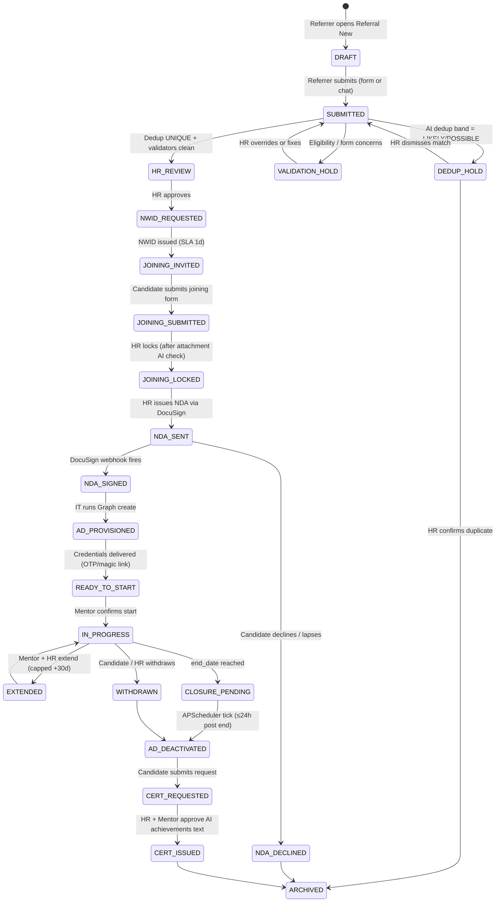

Every transition writes a row to `audit_events` (actor, before/after JSON, IP). Every transition that has external impact (email, Graph call, DocuSign) also writes a `notification_events` and/or `agent_tool_calls` row.

---

## 3. Flow F1 — Referral intake (classic form path)

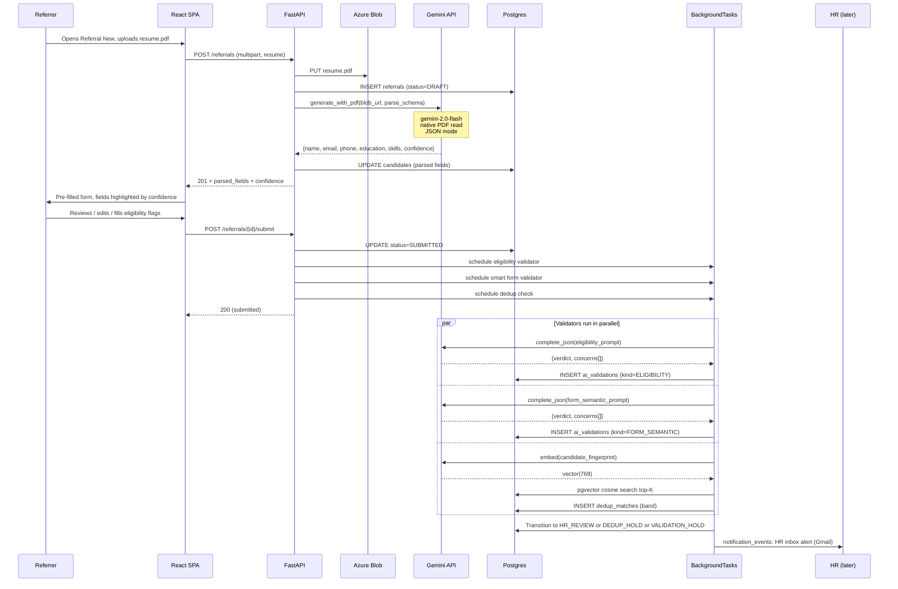

Why background tasks for validation: keeps the UX snappy (200 OK in <500ms) while AI runs async; UI polls `GET /ai/validations?entity_id=...` with a "checking..." spinner. Resume parse stays synchronous because the user is waiting on it.

---

## 4. Flow F1' — Referral intake (conversational path)

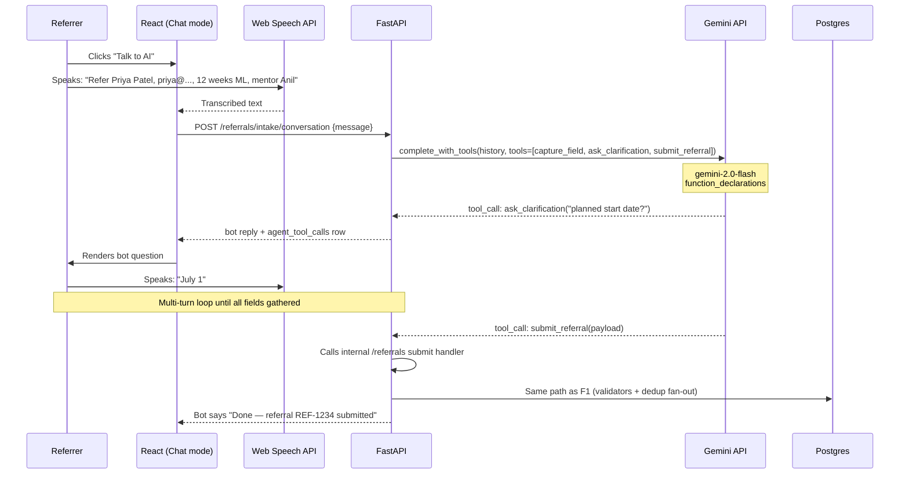

Same backend validators and dedup as F1 — the conversation just produces the same `referrals` row by a different route. Voice is optional; text input also works. Language is auto-detected; Gemini responds in the user's language for free (see §11 Multilingual).

---

## 5. Flow F2 — HR review, dedup, approval

```mermaid
sequenceDiagram
    participant HR
    participant UI as React (HR Inbox)
    participant API as FastAPI
    participant DB as Postgres
    participant G as Gemini
    participant BG as BackgroundTasks
    participant CAN as Candidate
    participant GMAIL as Gmail API

    HR->>UI: Opens HR Inbox
    UI->>API: GET /hr/inbox
    API->>DB: SELECT referrals WHERE status IN (HR_REVIEW, DEDUP_HOLD, VALIDATION_HOLD)
    API-->>UI: List with band labels (LIKELY / POSSIBLE / UNIQUE) + concern badges
    HR->>UI: Clicks one with band=POSSIBLE
    UI->>API: GET /dedup/matches/{referral_id}
    API-->>UI: Matched candidate(s), score, fingerprint diff
    HR->>UI: "Dismiss — different person"
    UI->>API: POST /dedup/matches/{id}/decide {decision: dismiss}
    API->>DB: UPDATE dedup_matches; transition to HR_REVIEW
    HR->>UI: Reviews concerns (eligibility/form), then Approve
    UI->>API: POST /hr/referrals/{id}/approve
    API->>DB: UPDATE status=NWID_REQUESTED + INSERT non_worker_ids (sla_due_at = +1d)
    API->>BG: draft_personalized_invite_email()
    BG->>G: complete_json(invite_email_prompt, candidate_data, mentor_data)
    G-->>BG: {subject, body_md}
    BG->>DB: INSERT ai_drafts (kind=EMAIL, status=pending)
    BG-->>HR: Notification: "AI invite draft ready for your review"
    HR->>UI: Opens AiDraftReview, edits one line, Approve
    UI->>API: POST /ai/communications/{draft_id}/approve
    API->>GMAIL: send_email(to=candidate, subject, body)
    GMAIL-->>API: messageId
    API->>DB: INSERT notification_events (status=sent)
    API->>DB: UPDATE status=JOINING_INVITED, magic_link_token issued
    API->>CAN: (email contains magic-link to /joining-forms/{token})
```

Note the **HR-in-the-loop** pattern: Gemini drafts every external comm, HR approves before send. This lifts the AI ratio without losing compliance control. For internal-only emails (e.g., reminder to a teammate) drafts auto-send.

---

## 6. Flow F3 — Joining form, attachments, attachment intelligence

```mermaid
sequenceDiagram
    participant CAN as Candidate
    participant UI as React (magic-link)
    participant API as FastAPI
    participant BLOB as Blob Storage
    participant G as Gemini
    participant DB as Postgres
    participant BG as BackgroundTasks
    participant HR

    CAN->>UI: Clicks magic link from email
    UI->>API: GET /joining-forms/{token} (validates token, role=candidate)
    API-->>UI: Form (multi-step), prefilled where possible
    CAN->>UI: Fills personal/edu/employment, uploads transcript.pdf, gov_id.png
    UI->>API: POST /joining-forms/{token}/attachments (transcript)
    API->>BLOB: PUT transcript.pdf
    API->>BG: schedule attachment intelligence
    UI->>API: POST /joining-forms/{token}/attachments (gov_id)
    API->>BLOB: PUT gov_id.png
    API->>BG: schedule attachment intelligence
    par Attachment AI runs per upload
        BG->>G: generate_with_pdf(transcript_url, extract_schema)
        Note over G: native vision —<br/>no Document Intelligence
        G-->>BG: {degree, institution, year, gpa}
        BG->>BG: cross_check_vs_declared(joining_form.education)
        BG->>DB: INSERT ai_validations (kind=ATTACHMENT, verdict, concerns)
    and
        BG->>G: generate_with_pdf(gov_id_url, extract_schema)
        G-->>BG: {id_number, name, dob}
        BG->>BG: cross_check_vs_declared(joining_form.gov_ids)
        BG->>DB: INSERT ai_validations (kind=ATTACHMENT, ...)
    end
    BG->>G: caption_image(gov_id_url)
    G-->>BG: alt_text
    BG->>DB: INSERT image_alt_text
    CAN->>UI: Submits form
    UI->>API: POST /joining-forms/{token}/submit
    API->>DB: UPDATE joining_forms.status=submitted, transition referral to JOINING_SUBMITTED
    API->>BG: smart form semantic validator
    BG->>G: complete_json(form_semantic_prompt)
    G-->>BG: concerns (e.g., phone country mismatch)
    BG->>DB: INSERT ai_validations (kind=FORM_SEMANTIC)
    HR->>UI: Sees joining queue + any concern badges
    HR->>API: POST /hr/joining/{id}/lock
    API->>DB: UPDATE locked_by, locked_at; transition to JOINING_LOCKED
```

Single-call simplicity: one Gemini API call per attachment does extraction + cross-check. With Document Intelligence, this would have been two services chained. With Gemini's native vision, it's one prompt with the PDF embedded.

---

## 7. Flow F4 — NDA issuance & signature

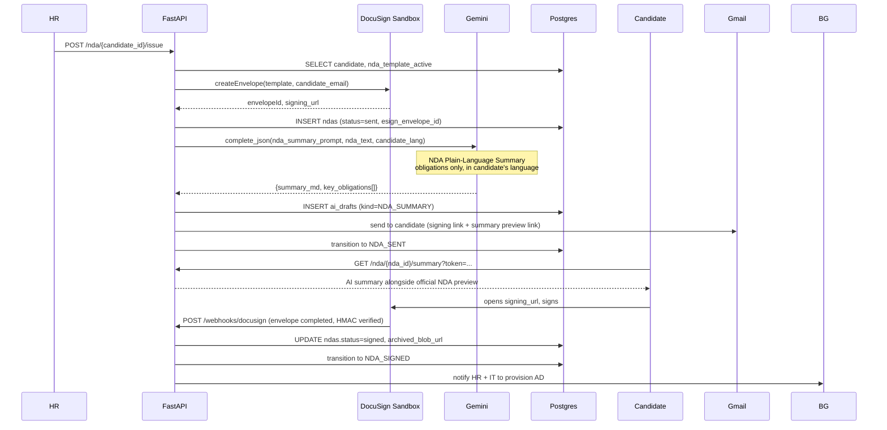

If the candidate declines or the envelope expires, the webhook fires the `NDA_DECLINED` transition; an HR escalation email is drafted by Gemini and sent.

---

## 8. Flow F5 — AD provisioning & credential delivery

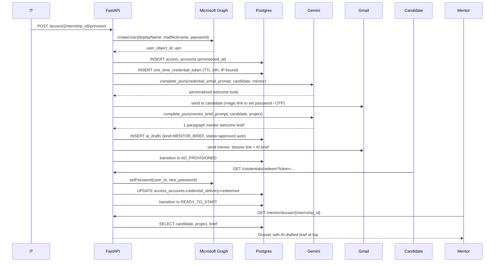

The candidate never sees a raw password — only a single-use token in the welcome email that they redeem to set their own password. This is the BRD's FR-13 "secure AD credential delivery (OTP/magic link)".

---

## 9. Flow F6 — Lifecycle (start, extend, close)

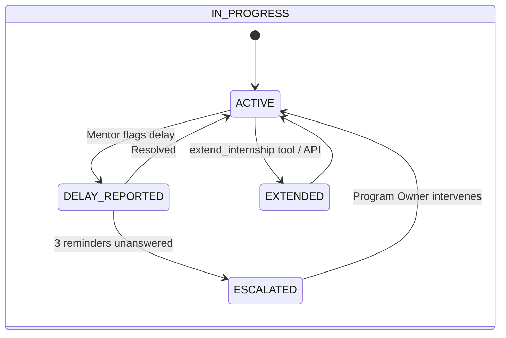

```mermaid
sequenceDiagram
    participant MNT as Mentor
    participant HR
    participant API as FastAPI
    participant G as Gemini
    participant DB as Postgres
    participant SCH as APScheduler

    Note over MNT,API: Start confirmation
    MNT->>API: POST /internships/{id}/start-confirmation
    API->>DB: UPDATE actual_start, status=IN_PROGRESS
    API->>SCH: schedule end_date_reminder (T-7d), closure_job (end_date+0)

    Note over MNT,API: Extension
    MNT->>API: POST /internships/{id}/extend {new_end_date}
    API->>API: validate +30d cap
    API->>DB: UPDATE end_date, status=EXTENDED→IN_PROGRESS
    API->>G: draft extension_notification_email
    G-->>API: body
    API->>DB: INSERT ai_drafts; sends after HR approval

    Note over SCH,DB: Closure (autonomous)
    SCH->>API: closure_job(internship_id) at end_date
    API->>DB: transition to CLOSURE_PENDING
    SCH->>API: ad_deactivate_job at end_date+24h
    API->>GR: disableUser
    API->>DB: UPDATE access_accounts.deactivated_at
    API->>DB: transition to AD_DEACTIVATED
    API->>G: draft cert_request_reminder for candidate
    API->>GMAIL: send
```

---

## 10. Flow F7 — Certificate request & issuance

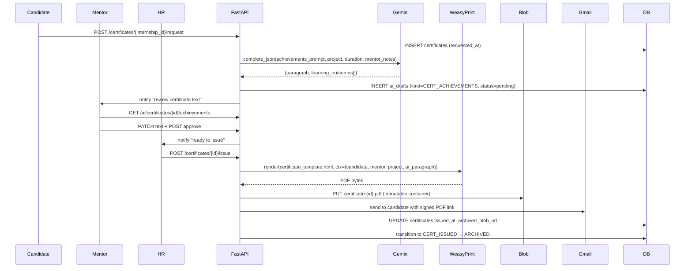

Two-person sign-off (mentor authors, HR issues) is a deliberate compliance hook — the AI drafts but doesn't issue.

---

## 11. Flow F8 — Agentic chatbot taking action

The chatbot has two modes that share a single endpoint: **Q&A** (RAG only, no tool calls) and **Agent** (tool calls). The LLM decides which.

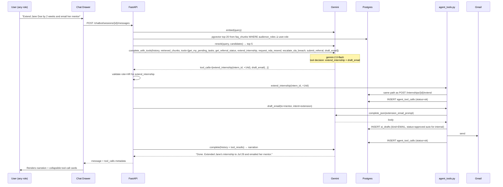

**Safety rails:**
- Each tool function checks `current_user.role` server-side before executing — the LLM cannot bypass RBAC.
- Destructive tools (`extend_internship`, `escalate_sla_breach`) prompt the user "Confirm?" before execution if the action exceeds a threshold.
- `extend_internship` capped at +30 days. No tool deletes data.
- All tool calls write to `agent_tool_calls` with full arguments and result for replay/audit.

**Tool registry (Week 4):**

| Tool | Allowed roles | Action |
|---|---|---|
| `get_my_pending_tasks()` | all | Read |
| `get_referral_status(referral_id)` | role-scoped (referrer/HR/PO see all assigned) | Read |
| `extend_internship(internship_id, days)` | mentor, HR | Mutate; capped 30d |
| `request_nda_resend(candidate_id)` | HR | DocuSign side-effect |
| `escalate_sla_breach(workflow_instance_id)` | PO | Email Program Owner |
| `submit_referral(payload)` | referrer | Internal call to F1 path |
| `draft_email(to, intent, context)` | all (auto-internal, HR-approval external) | Compose only |

---

## 12. Flow F9 — Background AI agents (autonomous)

Three APScheduler jobs run in the same process as FastAPI. None of them require user input.

### F9a — SLA risk prediction (every 5 min)

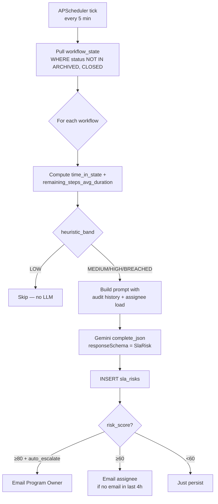

### F9b — Anomaly detection (hourly)

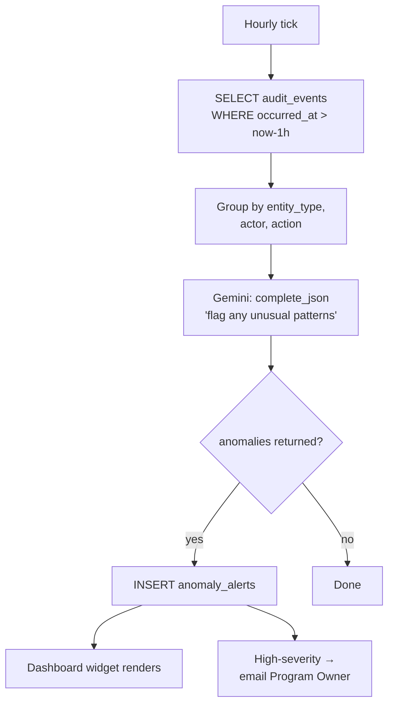

### F9c — Weekly executive digest (Sunday 22:00)

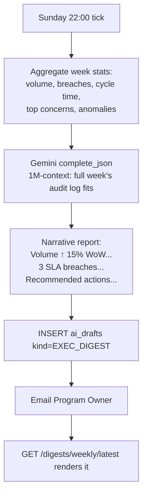

Gemini's 1M-token context lets the digest job pass the entire week of `audit_events` in one prompt without summarization tricks.

---

## 13. Notification & email matrix

Every email is either a fully-templated send or a Gemini-drafted send that goes through `ai_drafts`. External-recipient drafts require HR approval; internal-recipient drafts auto-send.

| Trigger event | Recipient | Channel | Drafted by | Approval gate |
|---|---|---|---|---|
| Referral submitted with concerns | HR | Gmail | Template | — |
| Referral approved by HR | Candidate | Gmail | Gemini | HR approves draft |
| Joining form magic-link | Candidate | Gmail | Template + Gemini personalization | HR approves |
| Joining form locked | Candidate | Gmail | Gemini | HR approves |
| NDA issued | Candidate | Gmail | Template + AI summary attached | Auto-send |
| NDA signed | HR + IT | Gmail | Template | Auto-send |
| AD credentials ready | Candidate | Gmail | Gemini personalized | HR approves |
| Mentor onboarding brief | Mentor | Gmail | Gemini | Auto (internal) |
| Internship start reminder | Mentor + Candidate | Gmail | Template | Auto |
| Internship end -7d | Mentor + Candidate | Gmail | Template | Auto |
| Internship extended | Mentor + Candidate + HR | Gmail | Gemini | HR approves (external) |
| AD deactivated | Candidate + Mentor | Gmail | Template | Auto |
| Certificate ready for review | Mentor | Gmail | Template | — |
| Certificate issued | Candidate | Gmail | Template + cert PDF | — |
| **SLA risk ≥ 60 (assignee)** | Assignee | Gmail | Gemini | Auto (internal) |
| **SLA risk auto-escalate ≥ 80** | Program Owner | Gmail | Gemini | Auto |
| **Anomaly high-severity** | Program Owner | Gmail | Gemini | Auto |
| **Weekly executive digest** | Program Owner | Gmail | Gemini | Auto |

---

## 14. SLA timer matrix

Each SLA timer is enforced by APScheduler scheduling a `check_sla` job at the SLA deadline; the SLA risk job (§9a) provides early warnings before the deadline arrives.

| State entered | SLA target | Owner | Breach action |
|---|---|---|---|
| `NWID_REQUESTED` | ≤ 1 business day | HR | Auto-escalate to Program Owner |
| `JOINING_INVITED` | 7 days for candidate to start | Candidate | Reminder cadence: T+3, T+5, T+7; if not started by T+10 → notify referrer to nudge candidate |
| `NDA_SENT` | Sign ≥ 1 day before `start_date` | Candidate | Block start until signed; HR escalation if start_date - 1d reached |
| `IN_PROGRESS` | Mentor must `start_confirm` within 3 days of `start_date` | Mentor | 3-strike reminder, then escalate |
| `CLOSURE_PENDING` | AD deactivation ≤ 24h post `end_date` | System | Auto job runs; alarm if Graph call fails |
| `CERT_REQUESTED` | Certificate issued within 5 business days | HR | Reminder + PO escalation |

---

## 15. AI-in-the-loop matrix per state transition

Where Gemini is involved in producing or validating data at each step. (See [Hackathon_MVP_Plan.md](./Hackathon_MVP_Plan.md) §AI footprint for the canonical 26-capability list.)

| Transition | AI surface | Output written to |
|---|---|---|
| DRAFT → SUBMITTED | Resume parse, eligibility validator, smart form validator, dedup embed | `candidates`, `ai_validations`, `dedup_matches` |
| SUBMITTED → DEDUP_HOLD | Dedup hybrid scoring (rules + cosine) | `dedup_matches.band` |
| HR_REVIEW → NWID_REQUESTED | AI-drafted invite email | `ai_drafts` (kind=EMAIL) |
| JOINING_SUBMITTED → JOINING_LOCKED | Attachment intelligence (vision), smart form validator | `ai_validations` (kind=ATTACHMENT, FORM_SEMANTIC) |
| JOINING_LOCKED → NDA_SENT | NDA plain-language summary | `ai_drafts` (kind=NDA_SUMMARY) |
| NDA_SIGNED → AD_PROVISIONED | Personalized welcome email | `ai_drafts` (kind=EMAIL) |
| (loaded) Mentor dossier | Mentor brief | `ai_drafts` (kind=MENTOR_BRIEF) |
| (saved) Project overview | Project scope analyzer | `ai_validations` (kind=SCOPE_ANALYZER) |
| Referrer leaves mentor blank | Mentor matchmaking | `mentor_match_runs.ranked_json` |
| CERT_REQUESTED → CERT_ISSUED | Achievements paragraph | `ai_drafts` (kind=CERT_ACHIEVEMENTS) |
| (any) Image uploaded | Alt-text caption | `image_alt_text` |
| (any) Workflow tick (5 min) | SLA risk prediction | `sla_risks` |
| (any) Hourly tick | Anomaly detection | `anomaly_alerts` |
| (any) Sunday 22:00 | Executive digest | `ai_drafts` (kind=EXEC_DIGEST) |
| (any) User chats | RAG + reranker + tools | `chat_messages`, `agent_tool_calls` |
| (any) User input | Language detection | (in-memory, drives prompt language) |
| (any) Candidate row UPDATE | Continuous re-embedding | `candidate_embeddings` |

---

## 16. Edge cases & branches

### 16.1 Duplicate detected (LIKELY band)
- AI score ≥ 0.92, deterministic email match, or phone E.164 match.
- Submit handler short-circuits before HR review queue: `status = DEDUP_HOLD`, HR notified.
- HR resolution endpoint: `/dedup/matches/{id}/decide` with `confirm_duplicate` (→ ARCHIVED) or `dismiss` (→ HR_REVIEW).
- Both decisions write to `audit_events` and `dedup_matches.decision`.

### 16.2 Eligibility flagged (e.g., declared in-person but candidate abroad)
- Validator writes concerns to `ai_validations`; transition jumps to `VALIDATION_HOLD`.
- HR sees concern badges on inbox row; can override (records `audit_events.action='ELIGIBILITY_OVERRIDE'`) or kick back to referrer.

### 16.3 Attachment field mismatch
- Vision extraction differs from declared joining form data → concern row.
- Joining form remains unsubmitted (HR cannot lock); candidate emailed for correction.

### 16.4 NDA declined or expired
- DocuSign webhook fires `NDA_DECLINED` → `ARCHIVED`.
- Gemini drafts notification to HR + referrer; HR can re-issue with updated template (`POST /nda/{candidate_id}/issue` again).

### 16.5 AD provisioning fails (Graph error)
- Circuit breaker on Graph integration; failure logs to `audit_events` and `notification_events.error`.
- IT alerted; manual retry endpoint `POST /access/{id}/provision?force_retry=true`.
- Candidate is *not* told until success — credential email is the success signal.

### 16.6 Internship withdrawn mid-flight
- Endpoint `POST /internships/{id}/withdraw` (HR or Candidate via support).
- Transitions: `IN_PROGRESS → WITHDRAWN → AD_DEACTIVATED`.
- No certificate is generated.

### 16.7 SLA breach (NWID > 1 business day)
- SLA risk job marks BREACHED; auto-escalation email to Program Owner.
- Dashboard widget surfaces at top with breach time and recommended action.

### 16.8 Chatbot tool call fails authorization
- Tool function returns `{"error": "permission_denied", "required_role": "HR"}`.
- LLM observes the error in next turn; narrates "I can't do that — only HR can extend internships."
- `agent_tool_calls.status='denied'` recorded.

---

## 17. Data flow — resume PDF lifecycle

```mermaid
flowchart LR
    A[Referrer<br/>uploads resume.pdf] --> B[FastAPI multipart]
    B --> C[Azure Blob<br/>intern-flow/resumes/{ref_id}.pdf]
    B --> D[Gemini API<br/>generate_with_pdf]
    D --> E[parsed JSON<br/>name, email, skills...]
    E --> F[Pydantic validate]
    F --> G[INSERT candidates]
    G --> H[Build fingerprint string<br/>name + email + skills + edu]
    H --> I[Gemini embed]
    I --> J[INSERT candidate_embeddings<br/>vector(768)]
    J --> K[pgvector cosine search<br/>top-K against existing candidates]
    K --> L[INSERT dedup_matches]
    L --> M[Band → workflow next state]
```

The PDF stays in Blob; only the parsed structured data and the embedding go into Postgres. Compliance retention policies apply at the Blob lifecycle level (immutable container with TTL).

---

## 18. Data flow — FAQ corpus lifecycle

```mermaid
flowchart LR
    A[seed/faqs/*.md<br/>committed in repo] --> B[POST /admin/faq/reindex]
    B --> C[faq_ingest.py<br/>chunk by heading + token budget]
    C --> D[Gemini embed batch]
    D --> E[INSERT faq_chunks<br/>vector(768) + audience_roles]
    E --> F[HNSW index built]

    G[User asks chatbot] --> H[Gemini embed query]
    H --> I[pgvector top-20 cosine,<br/>filter by user.role ∈ audience_roles]
    I --> J[Gemini reranker top-20→top-5]
    J --> K[Gemini answer with<br/>chunk citations]
    K --> L[INSERT chat_messages.citations_json]
```

When a FAQ document is added or edited (admin uploads via `/admin/faq/documents`), only the changed chunks are re-embedded — keeps embedding spend near zero.

---

## 19. Audit trail — what gets logged where

Every state-changing operation writes to `audit_events`. The table has DB-level `INSERT only` permission for the app role — tampering is blocked at the database tier.

| Action | actor_user_id | entity_type | entity_id | before/after |
|---|---|---|---|---|
| Resume parse override | Referrer | candidate | candidate.id | parsed_value → user_value |
| Eligibility override | HR | referral | referral.id | concerns → "overridden" |
| Dedup decision | HR | dedup_match | match.id | null → decision |
| NWID issuance | HR | non_worker_id | nwid.id | requested → issued |
| NDA sent | HR | nda | nda.id | null → sent |
| NDA signed | System (DocuSign) | nda | nda.id | sent → signed |
| AD provision | IT | access_account | account.id | null → provisioned |
| Internship extend | Mentor or Agent (chatbot) | internship | id | end_date_old → new |
| Certificate issue | HR | certificate | id | drafted → issued |
| **Agent tool call** | Agent (acting on user) | agent_tool_call | id | args, result |
| **AI validation produced** | System | ai_validation | id | (insert) |
| **AI draft approved** | HR | ai_draft | id | pending → approved |

The Program Owner audit log viewer (`GET /audit?entity_type=&entity_id=`) renders the full chain for any entity in chronological order.

---

## 20. Demo flow (5-minute recorded path)

The exact happy path to record before the hackathon presentation. Two browser windows side-by-side (Referrer + HR), with quick role-switches via incognito tabs for Candidate and Program Owner.

| t | Window | Action | What judges see |
|---|---|---|---|
| 0:00 | Referrer | Login + open Referral New | Mantine UI, role badge "Referrer" |
| 0:15 | Referrer | Upload `priya_resume.pdf` | Spinner; <8s later, all fields prefilled |
| 0:30 | Referrer | Toggle to chat mode, click voice, **speak in Hindi** the same referral | Bot transcribes, confirms in Hindi, submits |
| 1:00 | HR | Open HR Inbox | New referral with "POSSIBLE duplicate" badge |
| 1:10 | HR | Open dedup review | Side-by-side panels with score 0.87, dismiss |
| 1:25 | HR | Review eligibility concerns + approve | AI invite-email draft preview |
| 1:35 | HR | Edit one line, approve send | Gmail confirmation |
| 1:45 | Candidate (incognito) | Click magic link, fill form, upload transcript | Concern badge "transcript says B.Tech, declared M.Tech" |
| 2:30 | Candidate | Fix declaration, submit | HR notified |
| 2:45 | HR | Lock joining form, issue NDA | DocuSign envelope created with AI summary |
| 3:00 | Candidate | Open NDA link, see plain-language summary above legal doc, sign | Webhook fires, status → NDA_SIGNED |
| 3:30 | IT | Provision AD | Real Entra user appears |
| 3:45 | Candidate | Receive welcome email (real Gmail), redeem credential | Set password, see READY_TO_START |
| 4:00 | Mentor | Open dossier | AI brief paragraph at top |
| 4:10 | Program Owner | Open dashboard | Stage counts, SLA risk widget |
| 4:20 | Program Owner | Click "Recompute SLA risk" | One item flips to risk 87, "auto-escalate" fires Gmail |
| 4:35 | HR | Open chatbot, type "Extend Priya by 2 weeks and email mentor" | Tool call cards render, audit chain visible |
| 4:55 | Program Owner | Open Weekly Digest | Narrative report rendered |

Pre-seed conditions: closure-ready intern in DB so the cert flow can be triggered with a single button click; one stale workflow rigged to flip to high SLA risk on demand.

---

## 21. Quick reference — endpoint → flow map

If you're testing manually and want to know which flow an endpoint belongs to:

| Endpoint | Flow |
|---|---|
| `POST /referrals`, `/parse-resume`, `/submit` | F1 |
| `POST /referrals/intake/conversation` | F1' |
| `GET /hr/inbox`, `POST /hr/referrals/{id}/approve`, `/dedup/*` | F2 |
| `POST /joining-forms/{token}/*`, `POST /hr/joining/{id}/lock` | F3 |
| `POST /nda/{candidate_id}/issue`, `POST /webhooks/docusign`, `GET /ai/nda/{id}/summary` | F4 |
| `POST /access/{id}/provision`, `GET /credentials/redeem`, `GET /mentor/dossier/{id}` | F5 |
| `POST /internships/{id}/{start-confirmation,extend,close,withdraw}` | F6 |
| `POST /certificates/{id}/{request,issue}` | F7 |
| `POST /chatbot/sessions/{id}/messages` | F8 |
| `GET /sla/risks`, `POST /sla/risks/recompute` | F9a |
| `GET /anomalies` | F9b |
| `GET /digests/weekly/latest` | F9c |
| `POST /ai/mentors/suggest` | (Mentor matchmaking, embedded in F1) |
| `GET /i18n/strings/{locale}`, multilingual prompts | (cross-cutting; see §22) |
| `POST /ai/alt-text`, `POST /ai/a11y/audit` | (cross-cutting accessibility) |

---

## 22. Cross-cutting flows

### 22.1 Multilingual interaction
Every user-typed input goes through `gemini.detect_language()` (cheap, single small call). The system prompt for whatever AI surface is invoked appends `Respond in {detected_lang}.`. UI labels are pre-translated at build time by `scripts/build_i18n.py` for `en, hi, ta, te, kn, ml, es, fr` and served via `GET /i18n/strings/{locale}`. Web Speech API in the browser supports the same set natively.

### 22.2 Continuous candidate re-embedding
A SQLAlchemy `after_update` event listener on the `candidates` table enqueues a `BackgroundTask` to recompute the fingerprint embedding when any field affecting dedup changes. Latest embedding always represents current state, so dedup search stays accurate as joining-form data fills in.

### 22.3 Accessibility
On every Blob image upload (`POST /joining-forms/{token}/attachments` for images, `POST /access/.../profile-pic`), `BackgroundTask` calls `gemini.caption_image()` and writes `image_alt_text`. UI renders `` for any user-uploaded image. Admin panel surfaces `POST /ai/a11y/audit` with the current rendered HTML; CI gate fails if critical issues introduced.

---

## 23. Where to look when something breaks

| Symptom | First place to check |
|---|---|
| Resume parse returns empty fields | Blob URL accessibility from Gemini API → `audit_events.action='RESUME_PARSE'` for raw response |
| Dedup not catching obvious match | `candidate_embeddings.updated_at` (re-embed lag), then `dedup_matches.score` |
| HR inbox missing referrals | `referrals.status` — likely stuck in `DEDUP_HOLD` or `VALIDATION_HOLD` |
| NDA webhook never fires | `ngrok` tunnel down (dev) / DocuSign Connect not configured (prod) |
| AD user not created | `audit_events.action='AD_PROVISION_FAILED'` + Graph permission consent |
| Email not delivered | `notification_events.status` + `error` |
| Chatbot tool call has no effect | `agent_tool_calls.status` and `result_json` |
| SLA widget empty | APScheduler logs; `sla_risks.evaluated_at` for staleness |
| Multilingual UI not switching | `Accept-Language` reaching FastAPI middleware? `i18n_strings.locale` rows present? |

---

## 24. Glossary

- **NWID** — Non-Worker ID, the company's lightweight identity for unpaid interns.
- **Magic-link** — single-use, IP-bound, short-TTL token used to authenticate a candidate without password.
- **Band** (dedup) — LIKELY (≥0.92), POSSIBLE (≥0.85), UNIQUE (<0.85).
- **Heuristic band** (SLA) — LOW (<70% of SLA), MEDIUM (70–95%), HIGH (>95%), BREACHED.
- **Audience roles** (FAQ) — array on `faq_chunks` controlling who that chunk can be retrieved for; the chatbot filters by `user.role`.
- **Tool call** — when the chatbot invokes a Python function via Gemini's function-calling API; recorded in `agent_tool_calls`.
- **Draft** — an `ai_drafts` row representing AI-generated content awaiting (or having received) human approval before becoming an outbound action.
